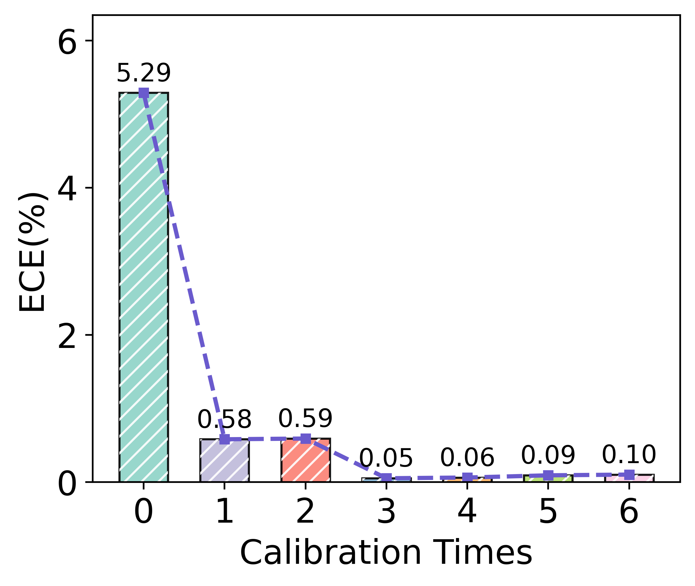
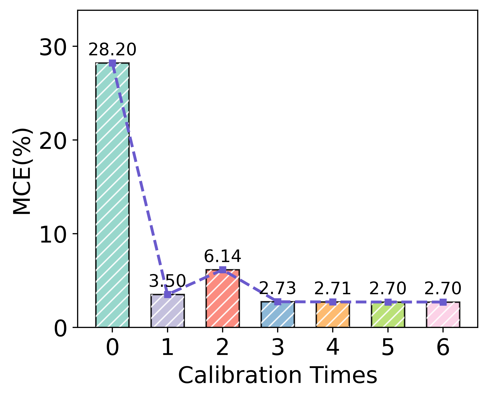
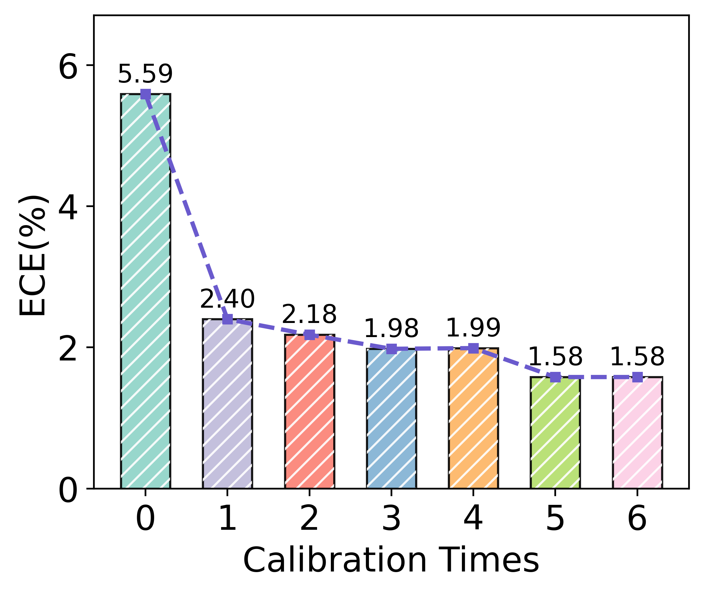
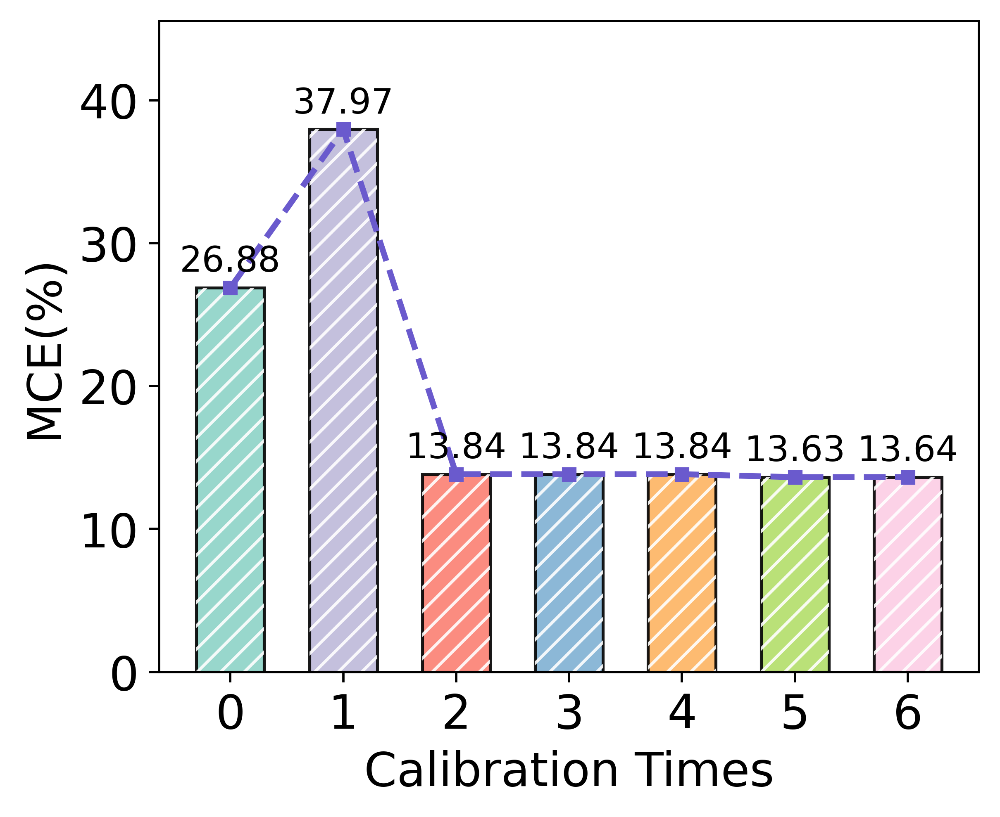
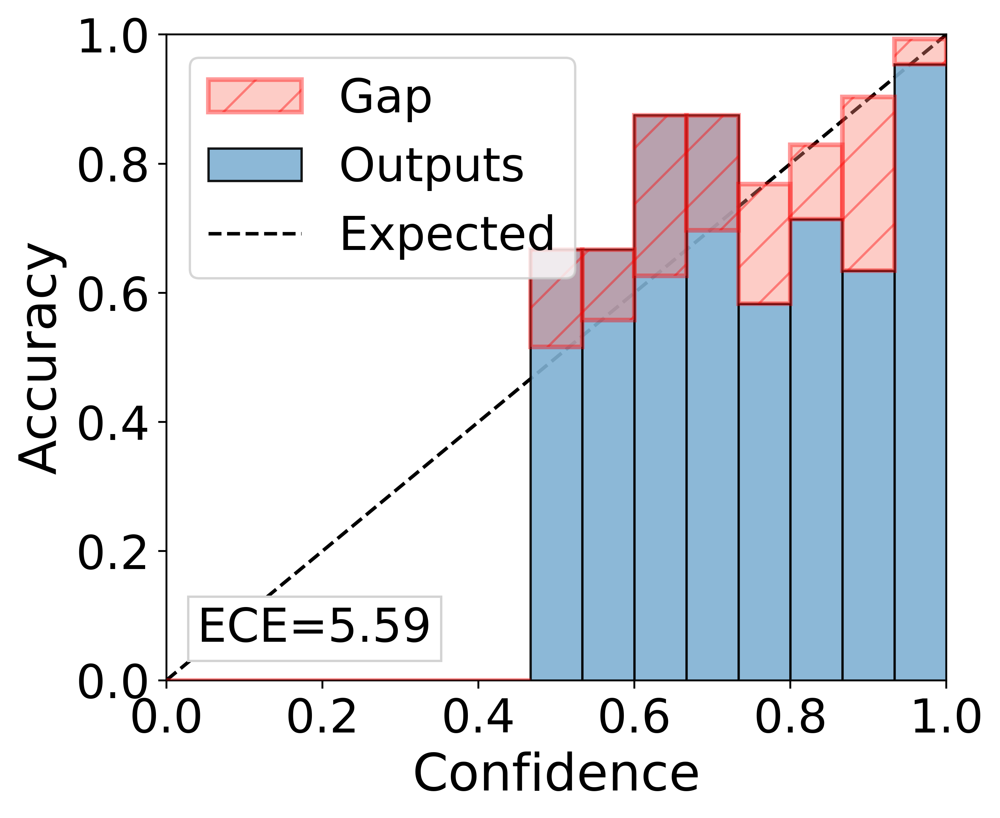
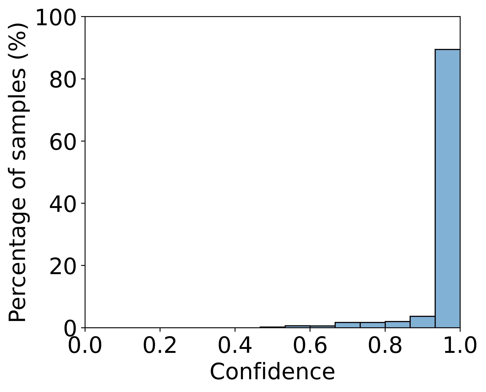
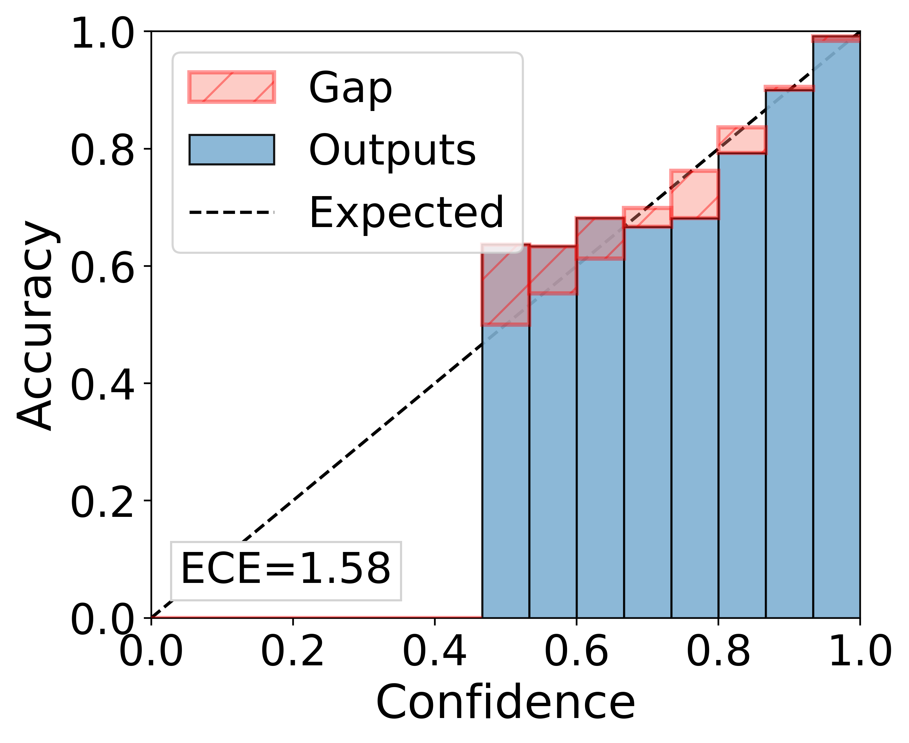
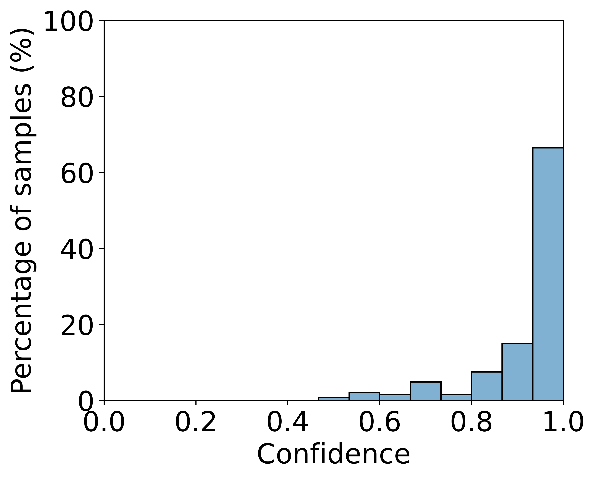

# Results
Comparison of results between Twitter and Weibo: 
| Method       | Accuracy (Twitter) | Precision (Twitter) | Recall (Twitter) | F1 Score (Twitter) | Accuracy (Weibo) | Precision (Weibo) | Recall (Weibo) | F1 Score (Weibo) |
|--------------|--------------------|---------------------|------------------|--------------------|------------------|-------------------|----------------|------------------|
| EANN         | 0.648              | 0.810               | 0.498            | 0.617              | 0.827            | 0.847             | 0.812          | 0.829            |
| MVAE         | 0.745              | 0.801               | 0.719            | 0.758              | 0.824            | 0.854             | 0.769          | 0.809            |
| SpotFake+    | 0.790              | 0.793               | 0.827            | 0.810              | 0.870            | 0.887             | 0.849          | 0.868            |
| MCAN         | 0.809              | 0.889               | 0.765            | 0.822              | 0.899            | 0.913             | 0.889          | 0.901            |
| LIIMR        | 0.831              | 0.836               | 0.832            | 0.830              | 0.900            | 0.882             | 0.823          | 0.847            |
| CSFND        | 0.833              | 0.899               | 0.799            | 0.846              | 0.895            | 0.899             | 0.895          | 0.897            |
| IFIS         | 0.838              | 0.909               | 0.841            | 0.874              | 0.896            | 0.916             | 0.855          | 0.887            |
| MFIR         | 0.858              | 0.850               | 0.848            | 0.849              | 0.925            | 0.901             | 0.839          | 0.869            |
| COOLANT      | 0.900              | 0.879               | **0.922**        | 0.900              | 0.923            | 0.927             | 0.923          | 0.925            |
| **Ours**     | **0.927**          | **0.981**           | 0.873            | **0.924**          | **0.949**        | **0.947**         | **0.954**      | **0.951**        |

<!--   -->

comparison with Fakeddit:
| Method          | Accuracy | Precision | Recall | F1 Score |
|-----------------|----------|-----------|--------|----------|
| EANN            | 0.875    | 0.904     | 0.881  | 0.893    |
| MVAE            | 0.888    | 0.901     | 0.914  | 0.907    |
| BERT & ResNet   | 0.894    | 0.912     | 0.912  | 0.912    |
| MMBT            | 0.911    | 0.927     | 0.925  | 0.926    |
| MTTV            | 0.919    | 0.935 | 0.930  | 0.933    |
| **Ours**        | **0.952**| **0.973** | **0.947**| **0.960**|

<!--  -->

Change in calibration frequency:

train:

 

test:

 
 

Before calibration:

 

After calibration:

 
 
